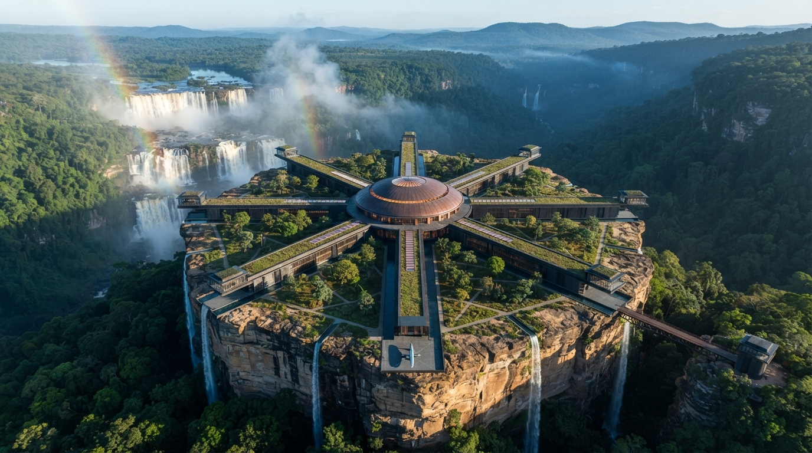
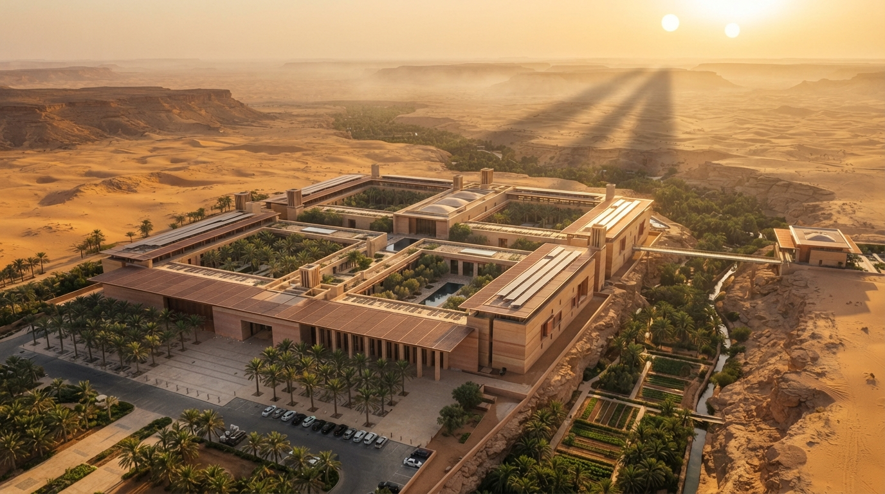

# Personajes ilustres y organizaciones. {#personajes-organizaciones}

```{r setup-cap05, include=FALSE}
knitr::opts_chunk$set(
  echo       = FALSE,
  message    = FALSE,
  warning    = FALSE,
  fig.align  = "center",
  out.width  = "90%"
)
source("_common.R")
```

{.portada-img width="100%"}
<div style="height: 1rem;"></div>

El sector no sería lo que es sin un puñado de personajes —analistas, científicos, magnates— cuyas decisiones han moldeado su desarrollo, y sin un puñado de organizaciones que vertebran su regulación y sus datos. Los manuales del proyecto los invocan a menudo; conviene tenerlos presentes.

```{r video-personajes, echo=FALSE, results='asis'}
insertar_youtube(
  id     = "8RYaLRjE8PY",
  titulo = "Personajes ilustres del Universo R-Stars."
)
```

## Los padres fundadores del dato. {#padres-dato}

### Dr. Sagan Olbers. {#olbers}

{.portada-img width="100%"}
<div style="height: 1rem;"></div>

Antiguo oficial de logística de la *Federación de Rutas Espaciales de Andrómeda* y creador, en 2137, de la **Base de Datos Interestelar**. Se le atribuye una tenacidad legendaria y una paciencia todavía mayor: convencer a treinta magnates —de tres especies distintas— de compartir sus libros contables se considera, en algunos círculos, un logro comparable al descubrimiento del propio *plasma warp*.

### Li Ti-Oh. {#li-ti-oh}

{.portada-img width="100%"}
<div style="height: 1rem;"></div>

Experta en transporte interestelar, radicada en Tatooine (Andrómeda). Autora del principal informe sectorial del año 2150 sobre orígenes, fortalezas y debilidades del comercio logístico. Sus análisis son de lectura obligada en las escuelas de negocio del sector.

## La escuela AITM. {#escuela-aitm}

Bajo el paraguas de la **Agencia Interplanetaria de Transporte de Mercancías** (AITM) opera un pequeño pero influyente grupo de investigadores cuyos informes marcan la agenda regulatoria del sector.

### Dra. Xelia Bluebird. {#bluebird}

{.portada-img width="100%"}
<div style="height: 1rem;"></div>

Responsable del célebre *Informe Bluebird*, que segmenta a las 300 compañías del sector según sus índices de **fidelización**, **diversificación** y **digitalización**. El informe se publica cada dos años y sus conclusiones mueven cotizaciones bursátiles.

### Dr. Oren Crestfall. {#crestfall}

{.portada-img width="100%"}
<div style="height: 1rem;"></div>

Analista técnico de la AITM. Dirige el *Informe Crestfall*, un estudio comparativo sobre la **fiabilidad** y el **rendimiento energético** de los cargueros producidos por los distintos astilleros. Sus *rankings* son temidos por los fabricantes y adorados por los aseguradores.

### Mara Qyà. {#qya}

{.portada-img width="100%"}
<div style="height: 1rem;"></div>

Directora de la **Autoridad Reguladora del Transporte Interestelar (ARTI)**, el organismo encargado de auditar la salud financiera de las compañías del sector. Formada en econometría aplicada en la Universidad de Arrakis, es conocida en los pasillos de la ARTI como *"la mujer que no firma nada sin un p-valor"*. Bajo su dirección, la ARTI ha endurecido las auditorías periódicas y ha convertido el análisis previo de datos —depuración de *missing values*, detección de *outliers*, estudio de correlaciones— en un requisito formal antes de cualquier informe regulatorio.

## Magnates y CEOs. {#magnates}

### Romulus Steiner. {#steiner}

{.portada-img width="100%"}
<div style="height: 1rem;"></div>

Máximo accionista y CEO histórico de *Arrakis Freight*. Nacido en el sistema homónimo, es —como su nombre delata— uno de los primeros altos ejecutivos **no humanos** del sector; hecho que hoy nadie se molesta en subrayar, pero que en la década de 2130 fue tema recurrente de tertulia. Su apoyo temprano al Dr. Olbers fue determinante para el nacimiento de la Base de Datos Interestelar. En círculos periodísticos se le conoce como *"el hombre —o lo que sea— que abrió los libros"*.

### Tasha Tachybaptus. {#tachybaptus}

{.portada-img width="100%"}
<div style="height: 1rem;"></div>

Actual CEO de *Shuttlepod Movers* (Sociedad Anónima Galáctica con sede en Arrakis). Su reto declarado es renovar la envejecida flota de la compañía sin comprometer su ya delicada liquidez; *"una ecuación con más incógnitas que ecuaciones"*, en palabras propias.

### Arg-us Korp. {#korp}

{.portada-img width="100%"}
<div style="height: 1rem;"></div>

Magnate reciente, tan poderoso como esquivo. Originario de un sistema fronterizo de la Galaxia del Triángulo, es asimismo de origen **no humano** y —según los pocos periodistas que han conseguido entrevistarle— tiene una noción del tiempo levemente distinta de la humana, lo que dificulta enormemente el cierre de las reuniones. Ha protagonizado en los últimos años una serie de adquisiciones estratégicas, la más sonada de las cuales es la compra de *Home One Cargo*, una firma especializada en nichos digitales de alto margen.

## Organizaciones e instituciones. {#organizaciones}

### Agencia Interplanetaria de Transporte de Mercancías (AITM). {#aitm}

{.portada-img width="100%"}
<div style="height: 1rem;"></div>

Organismo intergaláctico —y **multiespecífico**— encargado de **estudiar, segmentar y supervisar** el funcionamiento del sector. La AITM publica los informes de referencia (entre ellos los citados de Bluebird y Crestfall), mantiene las estadísticas oficiales y actúa como interlocutor técnico ante los organismos reguladores de las cinco galaxias.

Su **sede principal** se halla en la **Tierra** (Vía Láctea), en un valle alpino a orillas de un gran lago glaciar: un arco de pabellones bajos de hormigón visto, alerce y vidrio, con cubiertas vegetales que los funden en el paisaje y una torre esbelta de comunicaciones asomando sobre las montañas. En la plaza que da al lago, una larga hilera de banderas idénticas —una por sector y por especie— es la firma inconfundible de un organismo multiespecífico. Delegaciones permanentes en Andrómeda y Magallanes completan la red.

```{r video-aitm, echo=FALSE, results='asis'}
insertar_youtube(
  id     = "DP4K8bocDz4",
  titulo = "La Agencia Interplanetaria de Transporte de Mercancías (AITM)"
)
```

### Autoridad Reguladora del Transporte Interestelar (ARTI). {#arti}

{.portada-img width="100%"}
<div style="height: 1rem;"></div>

Organismo de **supervisión financiera** del sector, creado como brazo auditor independiente de la AITM. La ARTI tiene competencia para inspeccionar las cuentas de cualquier compañía de transporte interestelar, exigir la corrección de irregularidades y, en casos extremos, suspender temporalmente licencias de operación. Su directora actual, **Mara Qyà**, ha impuesto una cultura de análisis empírico riguroso: ningún informe de auditoría se emite sin un análisis previo de datos que incluya la depuración de valores faltantes, la detección de casos atípicos y el estudio de las relaciones entre las principales variables financieras.

Su **sede** se levanta sobre la **Luna** (Vía Láctea), en la llanura basáltica de un *mare* con la Tierra visible en el cielo negro como un creciente azul. La deliberada asepsia del emplazamiento —tres compañías con sede en el satélite y ningún astillero— es la garantía de independencia del regulador: nada que auditar en la puerta de casa. El campus, austero y simétrico, se organiza en tres pabellones blancos de hormigón y titanio en torno a una plaza central; tres grandes **domos geodésicos** encierran los únicos jardines del edificio —árboles, céspedes y estanques—, el punto más verde a este lado del sistema Tierra-Luna. En los pasillos de la ARTI al emplazamiento se le llama, con cierta autocomplacencia, *"nuestra Basilea"*.

### Autoridad Galáctica de Transporte Interestelar (AGTI). {#agti}

{.portada-img width="100%"}
<div style="height: 1rem;"></div>

Organismo encargado de la **concesión de licencias de operación** en rutas intergalácticas de alto valor estratégico. Sus procesos son especialmente estrictos en las rutas Coruscant–Arrakis y similares —que cruzan la **Gran Travesía**—, donde la seguridad de la especia condiciona toda la logística del sector.

Su **sede** se alza en **Coruscant** (Andrómeda), el mundo con mayor densidad corporativa del sector y cabecera de la ruta crítica Coruscant–Arrakis. El edificio ocupa una plataforma en voladizo sobre la ecumenópolis: un volumen escalonado de tres niveles en acero bronce y vidrio, con terrazas ajardinadas y cascadas de hiedra que se descuelgan cientos de metros por los flancos de la megaestructura —una isla verde diseñada deliberadamente como contrapunto al mar dorado de luces urbanas que la rodea—. En un extremo de la plataforma, varios muelles de inspección alineados con precisión reciben a los solicitantes de licencia: una imagen tan elocuente que a los pilotos veteranos les basta con decir *"me toca subir a Coruscant"* para que se entienda todo.

### Federación de Rutas Espaciales de Andrómeda. {#fre-andromeda}

{.portada-img width="100%"}
<div style="height: 1rem;"></div>

Institución logística histórica de la galaxia de Andrómeda, en la que se formó el Dr. Olbers antes de fundar la Base de Datos Interestelar. Continúa coordinando las rutas comerciales de Andrómeda y actúa como órgano consultivo de la AITM en materia intergaláctica.

Tiene su sede en **Naboo**, en lo alto de una meseta de arenisca al borde de una gran cascada de varios saltos. El complejo se organiza en planta radial, con una simbología perfectamente literal: una **Sala del Consejo** circular bajo una cúpula baja de cobre patinado, y varios brazos largos y bajos que se extienden desde ella como los radios de una rueda —arquitectura hecha memoria de las rutas históricas de Andrómeda—. Basalto pulido, cobre y cubiertas de sedum funden el edificio con el borde del acantilado; entre los brazos, jardines triangulares plantan cada uno un árbol nativo distinto. Fue aquí donde el joven Sagan Olbers, entonces oficial de logística, empezó a llevar registro sistemático de todo lo que pasaba por las escalas de la Federación —costumbre que años después desembocaría en la Base de Datos Interestelar.

### Asociación Sectorial de Transporte Interestelar (ASTI). {#asti}

{.portada-img width="100%"}
<div style="height: 1rem;"></div>

Órgano de representación empresarial del sector. Encarga estudios de percepción y satisfacción de clientes —como el llevado a cabo por la consultora *Data-Evidence* que da lugar a la base `percepcion_interestelar`— y actúa como interlocutor colectivo del sector ante la AITM y los reguladores.

Su **sede** se sitúa en **Tatooine** (Andrómeda), el planeta con más compañías del sector —17 sedes— y residencia habitual de Li Ti-Oh: cabía esperar que la asociación empresarial acabara asentándose allí. El edificio se levanta al borde de un cañón donde un antiguo acuífero alimenta un oasis cuidadosamente cultivado. La arquitectura es modernismo desértico sin concesiones —tierra apisonada ocre, arenisca y cobre cepillado— con muros macizos, aleros perforados que dibujan sombras precisas, torres de viento para refrigeración pasiva y cubiertas fotovoltaicas integradas como elemento arquitectónico. Tres patios interiores con palmeras datileras y estanques hacen habitable el conjunto; el oasis al pie, con sus huertos aterrazados, ha convertido a la sede de la ASTI en el destino tácito de todas las convenciones sectoriales de la galaxia.
