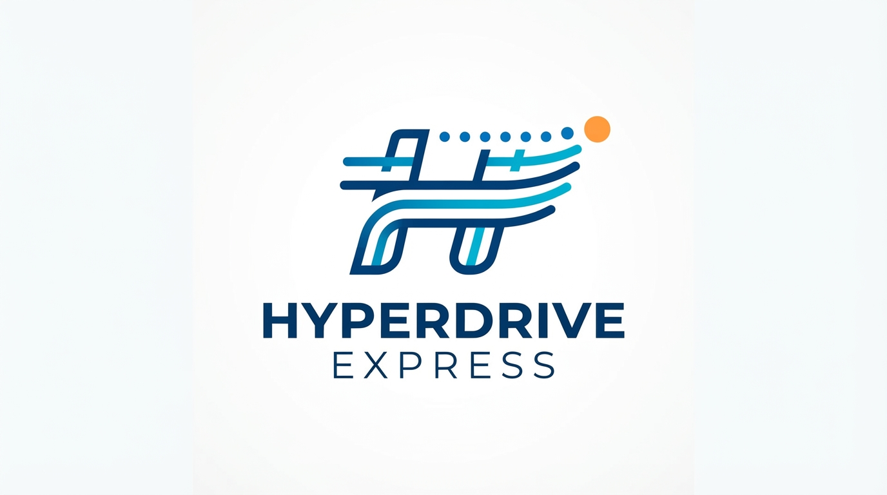
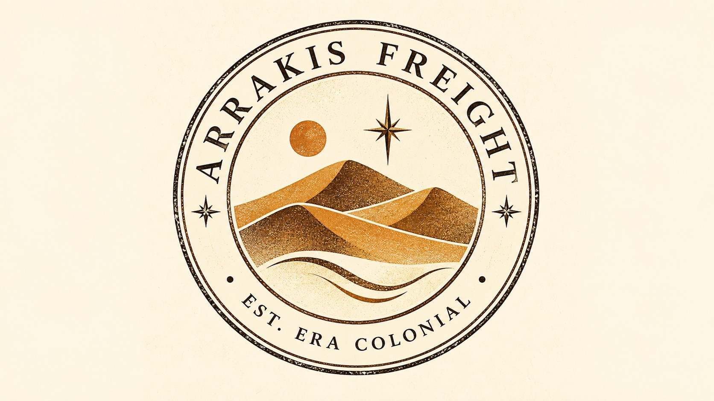
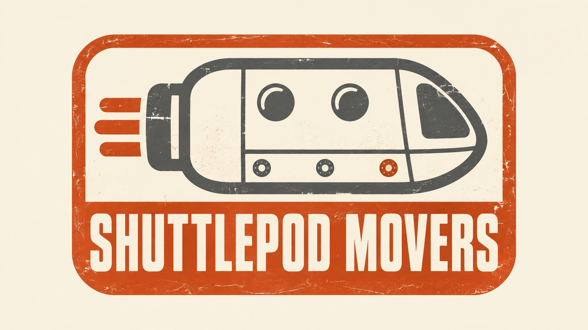
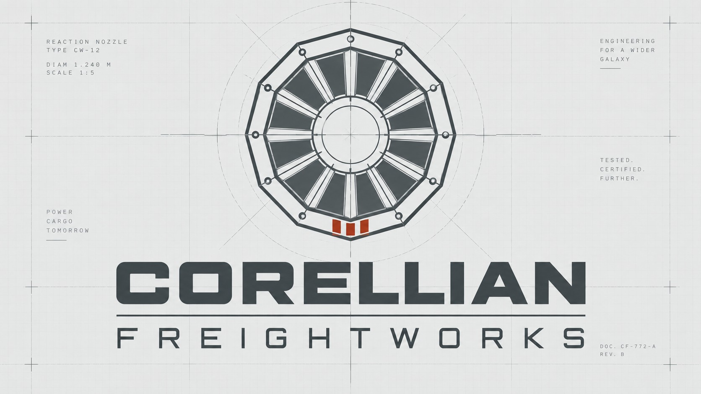
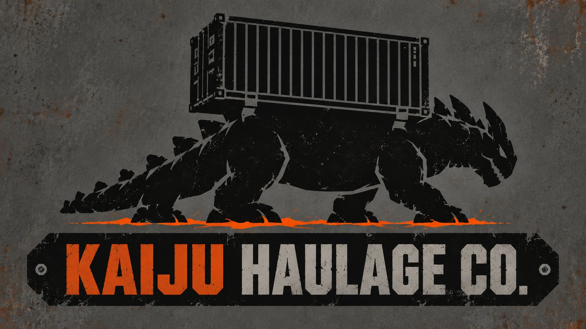

# Compañías y astilleros del sector. {#companias-astilleros}

```{r setup-cap06, include=FALSE}
knitr::opts_chunk$set(
  echo       = FALSE,
  message    = FALSE,
  warning    = FALSE,
  fig.align  = "center",
  out.width  = "90%"
)
```

{.portada-img width="100%"}
<div style="height: 1rem;"></div>

Trescientas compañías activas mueven casi ciento diez mil rutas anuales en cinco galaxias. Nadie las conoce todas —ni siquiera los analistas de la AITM las citan a diario—; pero un puñado de ellas concentra buena parte de las cabeceras del sector, y aparece de forma recurrente en los ejercicios de los manuales. Este capítulo repasa esas compañías, y presenta con algo más de detalle a los tres grandes fabricantes de cargueros: *Korrigan Heavy Works*, *Selene Dynamics* y *Arcturus Shipyards*.

## Las formas jurídicas. {#formas-juridicas}

En el sector coexisten tres formas jurídicas galácticas armonizadas por el TLCI:

- **Compañía Galáctica (CG).** Estructura clásica, con propiedad concentrada y responsabilidad limitada. Predomina en compañías medianas y en las de origen no humano.
- **Sociedad Limitada Galáctica (SLG).** Análoga a la SL terrestre; muy habitual en compañías familiares o de tamaño reducido.
- **Sociedad Anónima Galáctica (SAG).** Empresas de capital abierto, sujetas a auditorías más estrictas de la ARTI. Todas las grandes cotizadas del sector adoptan esta forma.

La base `interestelar_300` recoge esta variable como `FJUR` y la utiliza en varios ejercicios de los manuales.

## Las compañías más citadas. {#companias-citadas}

De las 300 compañías del sector, unas cuantas trascienden la base de datos y se convierten en **protagonistas recurrentes** de los ejemplos, casos y anécdotas de los tres libros del proyecto: *R-Stars: El Universo* (este libro), *R-Stars: La Guía* y *Estadística Empresarial*. Son las que el lector reconocerá de un capítulo a otro: la compañía cuya plantilla sirve para explicar la media, la que protagoniza un modelo de Poisson, la que un magnate acaba comprando tras un análisis de componentes principales.

Esta sección les dedica una **ficha** a las más señaladas. Los datos de la ficha proceden de la base `interestelar_300` y describen su *situación de partida* (activo, ingresos, plantilla, flota, rutas e índices de gestión). Conviene una advertencia: en los ejercicios, los autores a menudo **estilizan** las cifras —una plantilla de 60 nóminas redondas, una flota de 12 naves para un *box-plot*— para que las cuentas salgan limpias; esos números didácticos no siempre coinciden con los de la base, que es la que aquí se reproduce. Bajo cada ficha se indica **dónde aparece** la compañía, con libro y sección, y qué se sabe de sus CEOs y su trastienda narrativa.

<style>
.rs-ficha { border: 1px solid rgba(120,120,120,.35); border-radius: 10px; padding: .8rem 1rem; margin: .6rem 0 1rem; }
.rs-ficha-head { display: flex; flex-wrap: wrap; align-items: center; gap: .4rem; margin-bottom: .7rem; padding-bottom: .5rem; border-bottom: 1px solid rgba(120,120,120,.25); }
.rs-badge { display: inline-block; padding: .12rem .55rem; border-radius: 999px; border: 1px solid rgba(120,120,120,.5); font-size: .74rem; font-weight: 700; text-transform: uppercase; letter-spacing: .03em; }
.rs-badge.rs-fjur { background: rgba(120,120,140,.14); }
.rs-sede { margin-left: auto; font-size: .86rem; font-weight: 600; opacity: .85; }
.rs-grid { display: flex; flex-wrap: wrap; gap: .55rem .9rem; }
.rs-stat { display: flex; flex-direction: column; flex: 1 1 calc(25% - .9rem); min-width: 130px; }
@media (max-width: 720px) { .rs-stat { flex-basis: calc(50% - .9rem); } .rs-sede { margin-left: 0; width: 100%; } }
.rs-stat .rs-k { font-size: .7rem; text-transform: uppercase; letter-spacing: .02em; opacity: .6; }
.rs-stat .rs-v { font-size: .98rem; font-weight: 700; }
table.rs-otras { width: 100%; border-collapse: collapse; font-size: .9rem; margin: .4rem 0 1rem; }
table.rs-otras th { text-align: left; padding: .45rem .55rem; border-bottom: 2px solid rgba(120,120,120,.45); font-size: .74rem; text-transform: uppercase; letter-spacing: .03em; opacity: .8; }
table.rs-otras td { padding: .5rem .55rem; border-bottom: 1px solid rgba(120,120,120,.22); vertical-align: top; }
table.rs-otras td.rs-num { text-align: right; white-space: nowrap; font-variant-numeric: tabular-nums; }
.rs-tabla-wrap { overflow-x: auto; }
</style>

```{r fichas-datos, include=FALSE}
library(tibble)

# --- Situación de partida de las compañías (base interestelar_300) ---
# activo, ing en miles de PAVOs; margen/reneco/renfin en %; ifide/idig/idiverse índices.
fichas <- tribble(
  ~clave, ~nombre, ~sede, ~galaxia, ~fjur, ~eflo, ~activo, ~ing, ~margen, ~reneco, ~renfin, ~emplea, ~flota, ~rutas, ~ifide, ~idig, ~idiverse,
  "hyperdrive express", "Hyperdrive Express", "Miranda", "Gran Nube de Magallanes", "CG", "RENOVADA", 2499.94, 1788.26, 63.2, 45.21, 94.6, 60, 24, 1028, 68.15, 33.66, 35.79,
  "arrakis freight", "Arrakis Freight", "Arrakis", "Gran Nube de Magallanes", "CG", "RENOVADA", 2966.52, 2313.99, 51.42, 40.11, 82.55, 52, 24, 1165, 73.3, 58.51, 38.88,
  "shuttlepod movers", "Shuttlepod Movers", "Arrakis", "Gran Nube de Magallanes", "SAG", "MADURA", 249.39, 241.73, 74.8, 72.5, 167.49, 49, 47, 594, 43.07, 28.1, 40.68,
  "corellian freightworks", "Corellian Freightworks", "Qo'noS", "Galaxia del Triángulo", "SAG", "RENOVADA", 556.51, 424.33, 80.47, 61.36, 107.21, 106, 22, 472, 45.8, 30.12, 21.97,
  "kaiju haulage co.", "Kaiju Haulage Co.", "Mustafar", "Galaxia de Andrómeda", "SLG", "RENOVADA", 2332.33, 2385.49, 41.09, 42.03, 72.37, 62, 38, 1255, 71.38, 52.5, 49.85,
  "enterprise logistics", "Enterprise Logistics", "Naboo", "Galaxia de Andrómeda", "SLG", "MADURA", 164.25, 120.43, 64.8, 47.51, 125.37, 42, 39, 470, 40.4, 21.85, 32.77,
  "vader and company", "Vader & Company", "Mül", "Gran Nube de Magallanes", "SLG", "RENOVADA", 2665.75, 2471.54, 42.45, 39.36, 78.21, 55, 20, 1079, 68.77, 42.43, 34.39,
  "home one cargo", "Home One Cargo", "Coruscant", "Galaxia de Andrómeda", "CG", "RENOVADA", 1145.48, 1253.73, 48.62, 53.22, 111.87, 38, 16, 651, 46.78, 60.83, 22.18,
  "excalibur freight systems", "Excalibur Freight Systems", "Mül", "Gran Nube de Magallanes", "CG", "RENOVADA", 2524.75, 2021.79, 77.25, 61.86, 107.46, 50, 22, 1102, 79.15, 45.41, 36.18,
  "chakotay cargo systems", "Chakotay Cargo Systems", "Romulus", "Galaxia del Triángulo", "SLG", "RENOVADA", 2158.69, 1786.0, 44.84, 37.1, 82.44, 65, 46, 1229, 64.26, 42.72, 54.37,
  "sandworm freight", "Sandworm Freight", "Kobol", "Pequeña Nube de Magallanes", "SLG", "ANTIGUA", 17.55, 44.67, 35.12, 89.4, 180.97, 7, 8, 70, 30.86, 2.32, 3.96,
  "defiant cargo", "Defiant Cargo", "Tatooine", "Galaxia de Andrómeda", "SLG", "MADURA", 230.75, 128.9, 78.5, 43.85, 104.57, 40, 35, 438, 41.24, 22.03, 29.5,
  "endor express", "Endor Express", "Endor", "Galaxia de Andrómeda", "SAG", "ANTIGUA", 33.29, 21.01, 93.81, 59.21, 123.57, 20, 33, 270, 39.99, 12.94, 24.43,
  "first order cargo", "First Order Cargo", "Tatooine", "Galaxia de Andrómeda", "SLG", "ANTIGUA", 63.38, 34.8, 74.94, 41.15, 112.37, 26, 14, 122, 38.75, 5.16, 8.96,
  "starfighter logistics", "Starfighter Logistics", "La Luna", "Vía Láctea", "SAG", "ANTIGUA", 68.38, 58.52, 70.25, 60.12, 122.31, 41, 30, 253, 39.39, 11.87, 22.13,
  "mothership movers", "Mothership Movers", "Júpiter", "Vía Láctea", "SAG", "RENOVADA", 1193.48, 1213.59, 60.18, 61.2, 117.78, 45, 16, 629, 51.05, 27.97, 21.68,
  "ragnar freight lines", "Ragnar Freight Lines", "Nueva Caprica", "Galaxia del Triángulo", "CG", "MADURA", 242.31, 198.24, 55.56, 45.45, 90.13, 37, 45, 558, 40.69, 25.82, 38.59,
  "rebel alliance transport", "Rebel Alliance Transport", "Miller", "Pequeña Nube de Magallanes", "SLG", "MADURA", 232.97, 258.8, 41.51, 46.11, 102.46, 68, 41, 521, 39.03, 26.19, 35.2,
  "prometheus transport", "Prometheus Transport", "LV-223", "Vía Láctea", "CG", "MADURA", 230.34, 194.21, 65.64, 55.34, 140.71, 37, 26, 348, 39.79, 17.43, 21.72,
  "dark star haulage", "Dark Star Haulage", "LV-223", "Vía Láctea", "CG", "ANTIGUA", 79.85, 40.77, 79.32, 40.5, 124.29, 32, 41, 340, 40.0, 16.65, 31.12,
  "hyperion star haulage", "Hyperion Star Haulage", "Tierra", "Vía Láctea", "SAG", "MADURA", 211.14, 405.29, 41.51, 79.69, 189.17, 35, 14, 244, 26.44, 13.74, 11.72,
  "event horizon haulage", "Event Horizon Haulage", "Planet P", "Vía Láctea", "SAG", "MADURA", 204.46, 195.05, 37.02, 35.32, 84.68, 31, 13, 198, 29.63, 12.67, 10.04,
  "betazoid transport", "Betazoid Transport", "Tierra", "Vía Láctea", "SLG", "ANTIGUA", 56.25, 45.95, 83.79, 68.44, 164.18, 19, 48, 395, 40.27, 19.51, 36.82,
  "skywalker freight co.", "Skywalker Freight Co.", "La Tierra (Final)", "Galaxia del Triángulo", "SAG", "ANTIGUA", 51.26, 42.35, 70.04, 57.86, 169.29, 21, 47, 386, 39.85, 19.24, 35.98,
  "tannhäuser freight", "Tannhäuser Freight", "Pandora", "Vía Láctea", "SAG", "MADURA", 190.52, 172.94, 41.13, 37.33, 77.39, 41, 7, 2045, 42.64, 8.21, 47.89,
  "kamino movers", "Kamino Movers", "LV-223", "Vía Láctea", "SLG", "RENOVADA", 505.96, 483.6, 67.8, 64.8, 145.19, 35, 27, 536, 44.53, 32.72, 26.6,
  "alderaan freight", "Alderaan Freight", "Pandora", "Vía Láctea", "SLG", "ANTIGUA", 52.0, 32.67, 81.42, 51.15, 167.72, 28, 47, 385, 40.02, 19.1, 35.96,
  "ezra bridger haulage", "Ezra Bridger Haulage", "Fhloston Paradise", "Gran Nube de Magallanes", "SLG", "RENOVADA", 534.88, 483.52, 49.49, 44.73, 123.21, 28, 12, 335, 34.11, 29.07, 12.49,
  "photon pack freight", "Photon Pack Freight", "Naboo", "Galaxia de Andrómeda", "SAG", "ANTIGUA", 57.78, 49.93, 48.79, 42.16, 77.21, 31, 33, 274, 38.6, 13.16, 24.52,
  "poe dameron cargo", "Poe Dameron Cargo", "Vulcano", "Galaxia del Triángulo", "SAG", "ANTIGUA", 49.68, 27.91, 96.49, 54.21, 119.42, 25, 20, 168, 40.14, 7.52, 13.83,
  "rogue one freight", "Rogue One Freight", "Kobol", "Pequeña Nube de Magallanes", "SLG", "MADURA", 216.11, 184.73, 58.58, 50.08, 126.31, 35, 22, 299, 38.04, 15.42, 18.06,
  "jovian logistics", "Jovian Logistics", "Miranda", "Gran Nube de Magallanes", "SAG", "MADURA", 220.56, 644.59, 32.11, 93.85, 262.25, 24, 25, 406, 29.77, 27.43, 22.39,
  "vega transport", "Vega Transport", "Qo'noS", "Galaxia del Triángulo", "SLG", "MADURA", 207.97, 216.42, 48.46, 50.43, 115.38, 26, 13, 205, 31.97, 14.33, 10.2,
  "starship express", "Starship Express", "Nueva Caprica", "Galaxia del Triángulo", "SLG", "RENOVADA", 2255.25, 1401.57, 67.87, 42.18, 93.35, 50, 24, 928, 62.36, 37.58, 33.53
)

fmt_mil <- function(x) formatC(round(x), big.mark = ".", format = "d")
fmt_pct <- function(x) paste0(formatC(x, format = "f", digits = 1, decimal.mark = ","), "%")
fmt_idx <- function(x) formatC(x, format = "f", digits = 1, decimal.mark = ",")
fjur_largo <- c(CG = "Compañía Galáctica",
                SLG = "Sociedad Limitada Galáctica",
                SAG = "Sociedad Anónima Galáctica")

ficha_card <- function(clave) {
  f <- fichas[fichas$clave == clave, ]
  pares <- list(
    c("Activo",                paste0(fmt_mil(f$activo), " miles PAVOs")),
    c("Ingresos",              paste0(fmt_mil(f$ing),    " miles PAVOs")),
    c("Margen operativo",      fmt_pct(f$margen)),
    c("Rent. económica",       fmt_pct(f$reneco)),
    c("Rent. financiera",      fmt_pct(f$renfin)),
    c("Empleados",             fmt_mil(f$emplea)),
    c("Flota",                 paste0(fmt_mil(f$flota), " cargueros")),
    c("Rutas",                 fmt_mil(f$rutas)),
    c("Fidelización (IFIDE)",  fmt_idx(f$ifide)),
    c("Digitalización (IDIG)", fmt_idx(f$idig)),
    c("Diversificación (IDIVERSE)", fmt_idx(f$idiverse))
  )
  celdas <- paste0(vapply(pares, function(p)
    sprintf('<div class="rs-stat"><span class="rs-k">%s</span><span class="rs-v">%s</span></div>',
            p[1], p[2]), character(1)), collapse = "")
  cat(sprintf(
'<div class="rs-ficha">
<div class="rs-ficha-head"><span class="rs-badge rs-fjur">%s</span><span class="rs-badge">Flota %s</span><span class="rs-sede">Sede: %s · %s</span></div>
<div class="rs-grid">%s</div>
</div>\n',
    f$fjur, tolower(f$eflo), f$sede, f$galaxia, celdas))
}
```

### Hyperdrive Express. {#hyperdrive}

{.portada-img width="100%"}
<div style="height: 1rem;"></div>

```{r ficha-hyperdrive, results='asis'}
ficha_card("hyperdrive express")
```

Compañía galáctica de tamaño medio con sede en **Miranda** (Gran Nube de Magallanes) y flota renovada de 24 cargueros. Es, sin discusión, la **compañía-guía de todo el proyecto**: su plantilla y su cuadro de mando son el hilo conductor con el que se introducen las medidas estadísticas básicas. Su CEO —cuyo salario, de 100 cientos de PAVOs, se usa como *outlier* de manual— ilustra por qué la política salarial de la plantilla y la retribución de la dirección no deben promediarse juntas.

*Aparece en:*

- ***Estadística Empresarial*, cap. 1** (*Un ejemplo de referencia: Hyperdrive Express*): plantilla de 60 empleados y cartera de 200 clientes como ejemplo transversal. También en el Problema 1.13 (cuadro de mando trimestral).
- ***Estadística Empresarial*, cap. 3**: cálculo de media, mediana, moda, cuartiles, desviación típica, coeficiente de variación (CV = 34,6 %) y curva de Lorenz; la CEO como caso de estudio de valores atípicos.
- ***Estadística Empresarial*, cap. 7**: probabilidad de Laplace, y los Problemas 7.8 y 7.9 (teorema de la probabilidad total y de Bayes sobre sus **tres proveedores** de reactores).
- ***Estadística Empresarial*, cap. 6** (Problema 6.13, auditoría del *Interstellar Weekly*) y **cap. 8** (variable aleatoria del ingreso operativo).
- ***R-Stars: La Guía***, prefacio y cap. 6 (análisis de componentes principales), como referencia comparativa.
- **Este libro, cap. 4** (Geografía): reseñada entre los mundos de Miranda.

### Arrakis Freight. {#arrakis-freight}

{.portada-img width="100%"}
<div style="height: 1rem;"></div>
```{r ficha-arrakis, results='asis'}
ficha_card("arrakis freight")
```

Compañía histórica del sector, ligada desde su fundación a la exportación de **especia** desde Arrakis. Encabeza sistemáticamente los rankings del *Informe Bluebird* y es la empresa de referencia para hablar de **fidelización** de clientes (IFIDE = 73,3, de las más altas del sector).

- **CEO histórico: Romulus Steiner.** Máximo accionista y uno de los primeros altos ejecutivos **no humanos** del sector; su apoyo temprano al Dr. Sagan Olbers fue decisivo para el nacimiento de la Base de Datos Interestelar. En círculos periodísticos, *"el hombre —o lo que sea— que abrió los libros"* (este libro, cap. 5, *Magnates y CEOs*).

*Aparece en:*

- **Este libro, cap. 3** (*El monopolio de Arrakis*) y **cap. 2** (Cronología: la era colonial y el nacimiento de la Base de Datos Interestelar).
- ***Estadística Empresarial*, cap. 6**: Problema 6.13 (auditoría del *Interstellar Weekly*), donde encabeza el crecimiento real del quinquenio en términos constantes.
- ***R-Stars: La Guía*, cap. 12** (Escalado Multidimensional): una de las 15 compañías del mapa perceptual de *Data-Evidence*; grupo de flota renovada mejor valorado.
- ***R-Stars: La Guía*, cap. 6**: aparece en cabeza del *ranking* de componentes principales tras depurar *outliers*.

### Shuttlepod Movers. {#shuttlepod}

{.portada-img width="100%"}
<div style="height: 1rem;"></div>

```{r ficha-shuttlepod, results='asis'}
ficha_card("shuttlepod movers")
```

Sociedad Anónima Galáctica con sede en **Arrakis**, flota **madura** de 47 cargueros y una plantilla de 49 trabajadores. Precisamente esa plantilla es la que alimenta la base `trabajadores`, con la que se estudia el salario, el nivel de estudios y el departamento. Su gran tema abierto es el **relevo de la flota** sin comprometer la (delicada) liquidez.

- **CEO: Tasha Tachybaptus.** Su reto declarado —renovar la flota sin dañar la liquidez— lo resume como *"una ecuación con más incógnitas que ecuaciones"* (este libro, cap. 5). En *La Guía* (cap. 12) toma nota de la posición de su empresa en el mapa perceptual y comenta que *"ahora entiendo por qué nos comparan con Defiant Cargo"*.

*Aparece en:*

- ***R-Stars: La Guía*, cap. 4** (Estadística descriptiva): caso central *"¿una estructura salarial demasiado plana?"*, con análisis completo de la variable SALARIO (media 16,04; CV 34,4 %).
- ***Estadística Empresarial*, cap. 3 y 4**: comparación de dispersión salarial frente a *Hyperdrive Express* y ejemplo de plantilla bidimensional.
- ***R-Stars: La Guía*, cap. 6 y 12**: *scores* de componentes principales y mapa perceptual (percibida como muy similar a *Defiant Cargo*).

### Corellian Freightworks. {#corellian}

{.portada-img width="100%"}
<div style="height: 1rem;"></div>
```{r ficha-corellian, results='asis'}
ficha_card("corellian freightworks")
```

Sociedad Anónima Galáctica con sede en **Qo'noS** (Galaxia del Triángulo), presentada en los ejercicios como una de las grandes compañías de carga del sector. Tras absorber a dos operadores menores, su dirección financiera se propuso armonizar la política retributiva, lo que la convierte en el escenario ideal para hablar de estructuras salariales y de independencia estadística.

- **Personaje:** el **ingeniero jefe Anakin Falco** dirige su fábrica de reactores en Qo'noS, que certifica una tanda solo cuando pasan **tres reactores válidos** el banco de pruebas ($p = 0{,}8$) — el caso canónico de la binomial negativa.

*Aparece en:*

- ***Estadística Empresarial*, cap. 3** (Problema 3.2, *Dos plantillas, una misma media*): su CV del 32 % frente al 9 % de *Enterprise Logistics*.
- ***Estadística Empresarial*, cap. 4** (*ejemplo de independencia "perfecta"*): salario frente a gasto en cantina, estadísticamente independientes.
- ***Estadística Empresarial*, cap. 6** (Problemas 6.1, 6.2 y 6.13): números índice de la ruta Corellia–Qo'noS.
- ***Estadística Empresarial*, cap. 9** (binomial negativa, fábrica de reactores) y **cap. 10** (Problema 10.11, propiedad reproductiva de la normal).
- ***R-Stars: La Guía*, cap. 12**: una de las 15 compañías del mapa perceptual.

### Kaiju Haulage Co. {#kaiju}

{.portada-img width="100%"}
<div style="height: 1rem;"></div>

```{r ficha-kaiju, results='asis'}
ficha_card("kaiju haulage co.")
```

Sociedad Limitada Galáctica con base en **Mustafar** (Andrómeda), especializada en cargamentos de gran tonelaje. Su reputación técnica convive con la **inestabilidad política** del planeta base —es el carguero que la coda de los manuales imagina *"averiado en Mustafar"*—.

*Aparece en:*

- ***Estadística Empresarial*, cap. 3** (Problema 3.4): cuartiles y *box-plot* de la antigüedad de una flota de 12 cargueros; y el informe salarial que remite a **Mara Qyà** (ARTI).
- ***Estadística Empresarial*, cap. 4** (Problema 4.2, *Dos lecturas de un mismo cruce*): tabla de contingencia turno × categoría sobre 200 empleados.
- ***Estadística Empresarial*, cap. 7 y 10**: llegada de pedidos como proceso de Poisson (6 pedidos/hora).
- ***R-Stars: La Guía*, cap. 12**: mapa perceptual, en el grupo de flota renovada mejor valorada.
- **Este libro, cap. 4** (Mustafar) y cap. 8 (coda).

### Vader & Company. {#vader-co}

```{r ficha-vader, results='asis'}
ficha_card("vader and company")
```

Una de las primeras compañías especializadas en cargamentos masivos a larga distancia, con sede en **Mül**. Célebre por sus márgenes y —en no menor medida— por su severa política de recursos humanos y su departamento de atención al cliente *notoriamente asfixiante*.

*Aparece en:*

- ***Estadística Empresarial*, cap. 9** (Ejemplo 1, *piratas espaciales en la ruta Coruscant–Naboo*): modelo de Poisson con $\lambda = 2{,}3$ avistamientos por semana.
- ***Estadística Empresarial*, cap. 10**: tiempo entre entradas de nuevos clientes como ejemplo de distribución exponencial.
- **Este libro, cap. 2** (Cronología): citada, junto a *Arrakis Freight*, entre las primeras grandes transportistas de la era colonial.

### Enterprise Logistics. {#enterprise}

```{r ficha-enterprise, results='asis'}
ficha_card("enterprise logistics")
```

Compañía tradicional con sede en **Naboo**, **pionera de rutas** y célebre por su lema *"llegar donde ningún carguero llegó antes"*. En los manuales sirve de contrapunto a *Corellian Freightworks*: misma media salarial, pero dispersión mínima (plantilla muy homogénea, con el coeficiente de variación más bajo de los ejemplos).

*Aparece en:*

- ***Estadística Empresarial*, cap. 3** (Problema 3.2): la plantilla "compacta" (CV = 9 %) frente a *Corellian Freightworks*.
- ***Estadística Empresarial*, cap. 5** (Problema 5.12): linealización de una **curva de aprendizaje** en su escuela de pilotos.
- ***Estadística Empresarial*, cap. 10 y 11**: servidor de red con llegadas de Poisson y aproximación Poisson → normal (Problemas 10.18, 10.19 y 11.11).
- **Este libro, cap. 4** (Naboo).

### Excalibur Freight Systems. {#excalibur}

```{r ficha-excalibur, results='asis'}
ficha_card("excalibur freight systems")
```

Compañía galáctica con sede en **Mül** y una de las flotas mejor valoradas del sector (fidelización IFIDE = 79,2, la más alta entre las compañías destacadas). Aparece como caso de servicio fiable y puntual.

*Aparece en:*

- ***Estadística Empresarial*, cap. 9 y 10**: sus cargueros *"que llegan a tiempo"* ilustran la estructura común de la binomial, y sus reservas de ruta, el tiempo hasta el próximo suceso (exponencial).
- ***R-Stars: La Guía*, cap. 12**: mapa perceptual, en el grupo de flota renovada mejor valorada, junto a *Arrakis Freight* y *Kaiju Haulage Co.*

### Home One Cargo. {#home-one}

```{r ficha-home-one, results='asis'}
ficha_card("home one cargo")
```

Firma especializada en **nichos digitales** de alto margen, con sede en Coruscant y el índice de digitalización más alto de las compañías destacadas (IDIG = 60,8). Su perfil —muy digitalizada pero de diversificación moderada— la convierte en una empresa *singular* en los análisis multivariantes.

- **Operación corporativa:** el magnate **Arg-us Korp** la **adquirió** tras un análisis de componentes principales de su equipo; *"sabía que había hecho una buena compra"*, murmuró al conocer los resultados del *Informe Bluebird* (este libro, cap. 5; *La Guía*, caps. 6 y 7).

*Aparece en:*

- ***R-Stars: La Guía*, cap. 6** (*La decisión de Arg-Us Korp*): encabeza de forma consistente los tres *rankings* de preparación para el futuro.
- ***R-Stars: La Guía*, cap. 7** (Informe *Bluebird*): en el panel de 25 candidatas premium queda aislada en un clúster unipersonal por su perfil digital diferenciado.
- **Este libro, cap. 5** (Arg-us Korp).

### Otras compañías con papel en los manuales. {#otras-companias}

Más allá de las anteriores, otras muchas compañías protagonizan ejemplos concretos —sobre todo en los capítulos de análisis multivariante de *La Guía*—. La tabla siguiente recoge las más señaladas, con su situación de partida y el lugar donde se citan.

```{r otras-companias-tabla, results='asis'}
roles <- c(
  "chakotay cargo systems"  = "*La Guía*, cap. 6 y 7: <em>outlier</em> singular; clúster unipersonal de alta diversificación y fidelización.",
  "kamino movers"           = "*La Guía*, cap. 6: entre las mejor situadas en la 1ª componente principal (preparación para el futuro).",
  "alderaan freight"        = "*La Guía*, cap. 6: caso de <em>missing value</em> eliminado en la depuración previa al PCA.",
  "ezra bridger haulage"    = "*La Guía*, cap. 6: caso de <em>missing value</em> eliminado en la depuración previa al PCA.",
  "hyperion star haulage"   = "*La Guía*, cap. 7: <em>outlier</em>; forma un grupo de perfil diferenciado en el clúster.",
  "event horizon haulage"   = "*La Guía*, cap. 7: grupo de perfil diferenciado junto a <em>Hyperion Star Haulage</em>.",
  "betazoid transport"      = "*La Guía*, cap. 7: se agrupa muy pronto (gran similitud) por el método de Ward.",
  "skywalker freight co."   = "*La Guía*, cap. 7: se agrupa muy pronto junto a <em>Betazoid Transport</em>.",
  "tannhäuser freight"      = "*La Guía*, cap. 7: <em>outlier</em> moderado en el diagnóstico del clúster.",
  "sandworm freight"        = "*La Guía*, cap. 5 (<em>outlier</em> en RENECO) y cap. 12: mapa perceptual, flota antigua.",
  "jovian logistics"        = "*La Guía*, cap. 5: <em>outlier</em> en RENECO, junto a <em>Sandworm Freight</em>.",
  "photon pack freight"     = "*La Guía*, cap. 5: caso con <em>missing value</em> en RENECO, eliminado.",
  "poe dameron cargo"       = "*La Guía*, cap. 5: caso con <em>missing value</em> eliminado.",
  "vega transport"          = "*La Guía*, cap. 2 y 5: síntesis de variables y caso con <em>missing value</em>.",
  "rogue one freight"       = "*La Guía*, cap. 5: ilustra la portada del capítulo de análisis previo de datos.",
  "defiant cargo"           = "*La Guía*, cap. 12: mapa perceptual; percibida como muy similar a <em>Shuttlepod Movers</em>.",
  "endor express"           = "*La Guía*, cap. 12: mapa perceptual, grupo de flota antigua.",
  "first order cargo"       = "*La Guía*, cap. 12: mapa perceptual, grupo de flota antigua.",
  "starfighter logistics"   = "*La Guía*, cap. 12: mapa perceptual, grupo de flota antigua.",
  "dark star haulage"       = "*La Guía*, cap. 12: mapa perceptual, grupo de flota antigua.",
  "mothership movers"       = "*La Guía*, cap. 12: una de las 15 compañías del mapa perceptual.",
  "ragnar freight lines"    = "*La Guía*, cap. 12: una de las 15 compañías del mapa perceptual.",
  "rebel alliance transport"= "*La Guía*, cap. 12: una de las 15 compañías del mapa perceptual.",
  "prometheus transport"    = "*La Guía*, cap. 12: una de las 15 compañías del mapa perceptual.",
  "starship express"        = "*Estadística Empresarial*, cap. 8: la distancia operada (DIST) como ejemplo de variable aleatoria continua."
)

inl <- function(s) {
  s <- gsub("\\*([^*]+)\\*", "<em>\\1</em>", s)  # *italics* -> <em>
  s
}
cat('<div class="rs-tabla-wrap"><table class="rs-otras">\n')
cat('<thead><tr><th>Compañía</th><th>Sede (galaxia)</th><th class="rs-num">Activo</th>',
    '<th class="rs-num">Empl.</th><th class="rs-num">Flota</th><th class="rs-num">Rutas</th>',
    '<th>Dónde se cita</th></tr></thead>\n<tbody>\n', sep = "")
for (k in names(roles)) {
  f <- fichas[fichas$clave == k, ]
  cat(sprintf(
    '<tr><td><strong>%s</strong></td><td>%s · %s</td><td class="rs-num">%s</td><td class="rs-num">%s</td><td class="rs-num">%s</td><td class="rs-num">%s</td><td>%s</td></tr>\n',
    f$nombre, f$sede, f$galaxia, fmt_mil(f$activo), fmt_mil(f$emplea),
    fmt_mil(f$flota), fmt_mil(f$rutas), inl(roles[[k]])))
}
cat('</tbody></table></div>\n')
```

Conviene recordar, por último, que muchos otros nombres del sector (*Death Star Deliveries*, *Millennium Haulage*, *Tantive IV Cargo*, *Serenity Cargo Co.*…) no protagonizan ejercicios, sino que pueblan la base como **guiños** cinematográficos y literarios; su catálogo completo, con sus fuentes de inspiración, se recoge en el capítulo de Guiños (cap. 8).

## Los tres grandes astilleros. {#astilleros}

El mercado de fabricación de cargueros está dominado por tres corporaciones. Sus naves —todas ellas propulsadas por **especia**— compiten en fiabilidad, rendimiento energético y precio. Los tres astilleros son la referencia común de los ejercicios sobre la base `astilleros_48`, utilizada en los capítulos sobre comparación de medias entre más de dos poblaciones y análisis de la covarianza.

### Korrigan Heavy Works. {#korrigan}

El fabricante clásico. Naves robustas, sobredimensionadas y algo caras de mantener, pero con una reputación de indestructibilidad que le mantiene una cuota de mercado estable.

### Selene Dynamics. {#selene}

El fabricante técnicamente más avanzado. Sus cargueros destacan sistemáticamente por un **rendimiento energético superior** y por una fiabilidad muy por encima de la media del sector. El *Informe Crestfall* la sitúa como referencia técnica desde hace tres bienios consecutivos.

### Arcturus Shipyards. {#arcturus}

El tercer gran fabricante. Estrategia agresiva de precios, catálogo amplio y presencia en todos los segmentos. Muy popular entre compañías medianas y en expansión.
